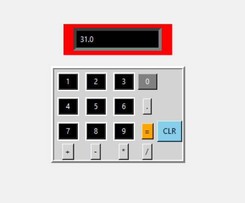

# calculator

This is a basic calculator application that I have built using the **Tkinter** module and **Python**.  
It supports basic arithmetic operations and has a simple, clean GUI.

---

## Features

- Clean and simple interface  
- Responsive layout using Tkinter  
- More features to be added soon!

---
## Screenshot




## Getting Started

### Prerequisites

- Python 3.x installed on your system

### Installation

1. Clone the repository:
   ```bash
   git clone https://github.com/the-flying-cow/calculator.git
   cd calculator
